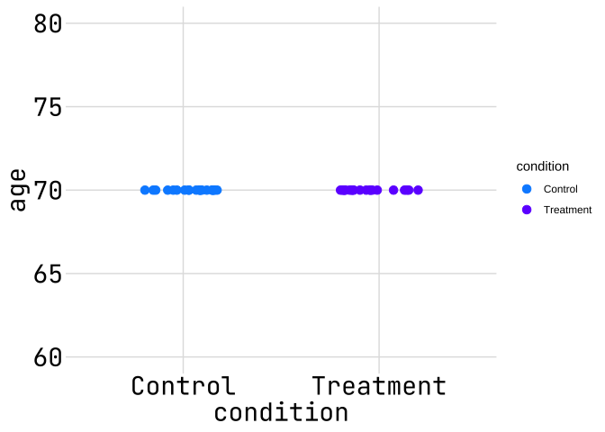
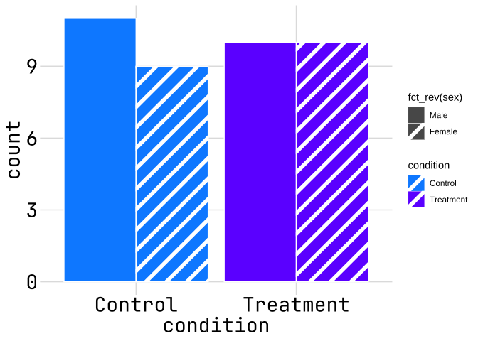
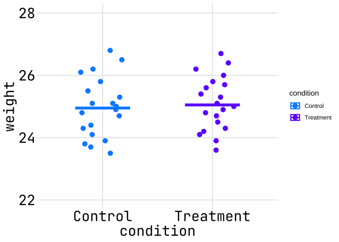
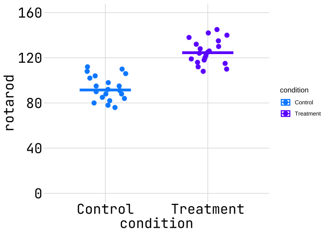
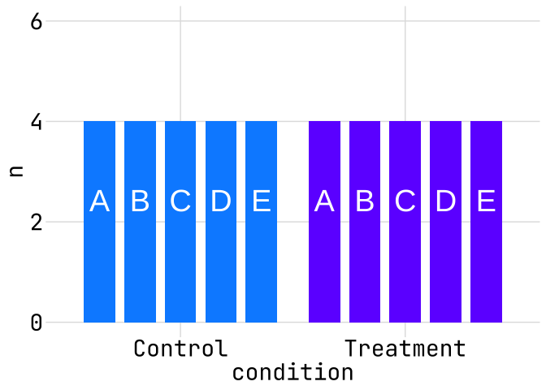

# Why Randomize Plots


# Setup

``` r
library(tidyverse)
```

    ── Attaching core tidyverse packages ──────────────────────── tidyverse 2.0.0 ──
    ✔ dplyr     1.2.0     ✔ readr     2.2.0
    ✔ forcats   1.0.0     ✔ stringr   1.6.0
    ✔ ggplot2   4.0.2     ✔ tibble    3.3.1
    ✔ lubridate 1.9.4     ✔ tidyr     1.3.2
    ✔ purrr     1.2.1     
    ── Conflicts ────────────────────────────────────────── tidyverse_conflicts() ──
    ✖ dplyr::filter() masks stats::filter()
    ✖ dplyr::lag()    masks stats::lag()
    ℹ Use the conflicted package (<http://conflicted.r-lib.org/>) to force all conflicts to become errors

``` r
library(ggpattern)
library(showtext)
```

    Loading required package: sysfonts
    Loading required package: showtextdb

``` r
## C4R styling defined here ----
plot_dpi <- 300
options(rstudio.plots.dpi = plot_dpi)
font_add_google("JetBrains Mono", "JetBrains Mono")
showtext_auto()

color_purple <- "#6F00FF"
color_blue <- "#008FFF"
color_dk_grey <- "#333132"
color_int_lt_grey <- "#A2A2A2"
color_int_dk_grey <- "#E0E0E0"
color_lt_grey <- "#F3F3F3"

theme_c4r <- function(fontsize = 14, plot_dpi = 300, solid_axis = FALSE) {
  theme_grey() +
    theme(
      # Panel
      panel.background = element_rect(fill = "white", colour = NA),
      panel.border = element_blank(),
      panel.grid = element_line(color = color_int_dk_grey),
      panel.grid.minor = element_blank(),

      # axes
      axis.line = element_line(
        color = color_dk_grey,
        linewidth = ifelse(solid_axis, 0.5, 0)
      ),
      axis.ticks = element_blank(),
      axis.text = element_text(
        family = "JetBrains Mono",
        size = fontsize * plot_dpi / 96
      ),
      axis.title = element_text(
        family = "JetBrains Mono",
        size = fontsize * plot_dpi / 96
      ),

      # Strip (facets)
      strip.background = element_rect(
        fill = color_int_lt_grey,
        colour = "grey20"
      ),

      # Legend
      legend.key = element_rect(fill = "white", colour = NA),

      # Complete theme
      complete = TRUE
    )
}
```

# Data

``` r
dat <- read_csv("data/why-randomize-data.csv") %>%
  rename(condition = group)
```

    Rows: 40 Columns: 8
    ── Column specification ────────────────────────────────────────────────────────
    Delimiter: ","
    chr (3): group, sex, litter
    dbl (5): mouse_id, age, weight, rotarod, survival

    ℹ Use `spec()` to retrieve the full column specification for this data.
    ℹ Specify the column types or set `show_col_types = FALSE` to quiet this message.

``` r
names(dat)
```

    [1] "mouse_id"  "condition" "sex"       "litter"    "age"       "weight"   
    [7] "rotarod"   "survival" 

# Plots in Activity

``` r
ggplot(dat, aes(x = condition, y = age, color = condition)) +
  geom_point(size = 3, position = position_jitter(width = 0.2, height = 0)) +
  theme_c4r(plot_dpi = 144) +
  scale_color_manual(values = c(color_blue, color_purple)) +
  coord_cartesian(ylim = c(60, 80))
```



``` r
ggplot(dat, aes(x = condition, fill = condition, pattern = fct_rev(sex))) +
  geom_bar_pattern(
    color = "white",
    pattern_fill = "white",
    pattern_colour = "white",
    pattern_angle = 45,
    position = "dodge"
  ) +
  theme_c4r(plot_dpi = 144) +
  scale_pattern_manual(values = c("none", "stripe")) +
  scale_fill_manual(values = c(color_blue, color_purple))
```



``` r
ggplot(dat, aes(x = condition, y = weight, color = condition)) +
  geom_point(size = 3, position = position_jitter(width = 0.2, height = 0)) +
  stat_summary(fun = median, geom = "crossbar", width = 0.5, linewidth = 0.8) +
  theme_c4r(plot_dpi = 144) +
  scale_color_manual(values = c(color_blue, color_purple)) +
  coord_cartesian(ylim = c(22, 28))
```



``` r
ggplot(dat, aes(x = condition, y = rotarod, color = condition)) +
  geom_point(size = 3, position = position_jitter(width = 0.2, height = 0)) +
  stat_summary(fun = median, geom = "crossbar", width = 0.5, linewidth = 0.8) +
  theme_c4r(plot_dpi = 144) +
  scale_color_manual(values = c(color_blue, color_purple)) +
  scale_y_continuous(breaks = seq(0, 160, by = 40)) +
  coord_cartesian(ylim = c(0, 160))
```



``` r
dat %>%
  count(condition, litter) %>%
  ggplot(aes(x = condition, y = n, fill = condition, group = litter)) +
  geom_col(position = position_dodge(width = 0.9), width = 0.7) +
  geom_text(
    aes(label = litter, y = n / 2),
    position = position_dodge(width = 0.9),
    vjust = -0.5,
    color = "white",
    size = 10
  ) +
  theme_c4r(plot_dpi = 144) +
  scale_fill_manual(values = c(color_blue, color_purple)) +
  theme(legend.position = "none") +
  coord_cartesian(ylim = c(0, 6))
```


